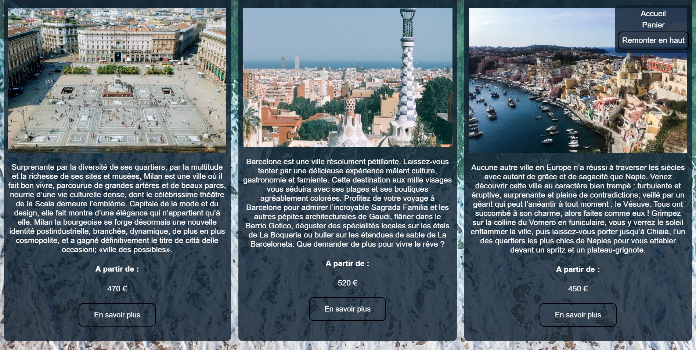
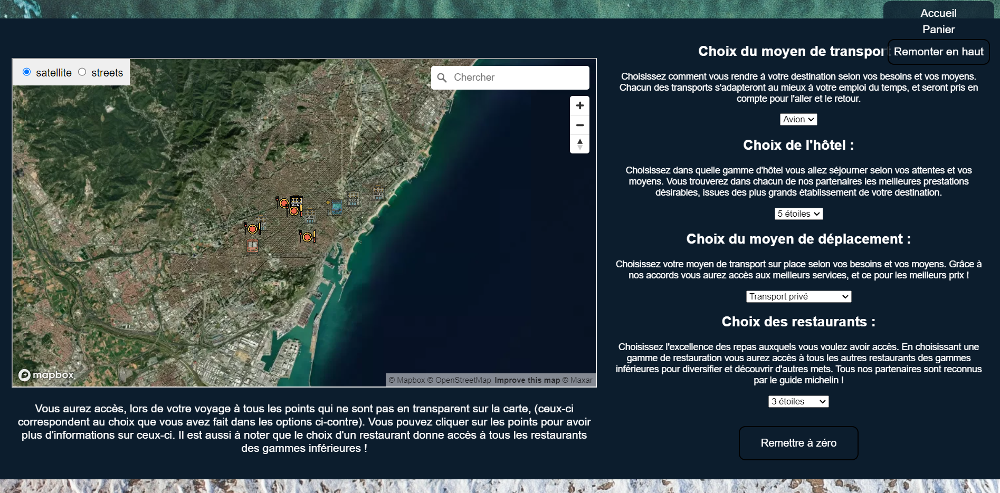

# Travel sales site example - 2022 / 2023

## Table of content
1. [General Information](#general-info)
3. [Files Organization](#organization)
4. [How to use](#how-to-use)


<a name="general-info"></a>
## General Information

This project is a school project. The objective of this project is to create a travel sales site for two people, for short stays/honeymoons. For this project, it is requested not to use any framework, the goal being the use of basic HTML, CSS and JS languages.

The site offers the following possibilities:
- possibility of choosing a trip (displayed in templates),
- possibility of filtering trips,
- possibility of personalizing the trip (with several options),
- display of options chosen during personalization on a map (in an iframe with the mapbox API),
- display of a personalized card according to advanced options (using a canvas),
- recording of trips already personalized in cookies,
- live calculation of the price of the trip according to the options,
- possibility of filling out a form and checking the validity of the information given,
- calculation of the total price dynamically, with management of the quantity, options, number of days and distance to send the travel card

In addition, the site has been developed to be as responsive as possible, and with a good user interface. All images and videos used are copyright free.

Because this is just a school project, the trips are not real, and only three trips are available. The site is not connected to a payment system, so the payment page is not functional.

Moreover, as this site was written for programming courses in France, the texts of the pages, the names of the pages and variables are in French


<a name="organization"></a>
## Files Organization

The project is organized as follow:
```
├── index.html
├── pages
│   ├── personnalisation.html
│   └── payment.html
├── css
│   ├── stylesheet.css
├── js
│   ├── script.js
│   ├── data.json
│   ├── headerfooter.json
│   └── token.json
├── images-videos
│   ├── barcelone
│   │   ├── barim1.jpg
│   │   ├── barim2.jpg
│   │   ├── barim3.jpg
│   │   └── barmain.jpg
│   ├── milan
│   │   ├── milim1.jpg
│   │   ├── milim2.jpg
│   │   ├── milim3.jpg
│   │   └── milmain.jpg
│   ├── naples
│   │   ├── napim1.jpg
│   │   ├── napim2.jpg
│   │   ├── napim3.jpg
│   │   └── napmain.jpg
│   ├── background.jpg
│   ├── brandIcon.png
│   ├── cartevoyage.png
│   ├── imagePanier.png
│   └── brandVideo.mp4
├── map
│   ├── mapmain.html
│   ├── mapstyle.css
│   ├── mapscript.js
│   ├── mapbarcelonedata.json
│   ├── mapmilandata.json
╵   └── mapnaplesdata.json
```

### [```index.html```](/index.html)
This is the main page of the website. It requires the video ```brandVideo.mp4``` and the images ```background.jpg```, ```barmain.jpg```, ```milmain.jpg``` and ```napmain.jpg```. On this page, the user can choose a trip and go to the personalization page. For this the user can filter the trips by price or country of destination. The user can also choose a trip by clicking on the image of the trip. The user can also see the trips he has already personalized and add them to his cart.


#

### [```personnalisation.html```](/pages/personnalisation.html)
This is the personalization page of the website. It requires the images ```barim[1,2,3].jpg``` or ```milim[1,2,3].jpg``` or ```napim[1,2,3].jpg```, depending on the trip chosen. On this page, the user can choose the between the four options provided : the means of transport to the destination, the type of accommodation, the means of transport on site and the type of restaurant. If the user as already personalized the trip, the options are already filled in.

The user can also see dynamically the price of the trip according to the options chosen. He can also see the options chosen on a map. The map is in an iframe and all the code that manage it is in the file ``map``. It as it's own html, css and js and the data for each trips are in the files ```mapbarcelonedata.json```, ```mapmilandata.json``` and ```mapnaplesdata.json```. The user can also see a personalized card according to the options chosen. The image for the canvas is in the file ```cartevoyage.png```.


#

### [```payment.html```](/pages/payment.html)
This is a really basic payment page for website. It requires the image ```imagePanier.png```. On this page, the user can see the trips he has already personalized and change the number of them in his cart. He can also fill out a form and see the total price of the trip, with the management of the quantity, options, number of days and distance to send the travel card.
#

### [```stylesheet.css```](/css/stylesheet.css)
This is the stylesheet of the website. It is used for all the pages.
#

### [```script.js```](/js/script.js)
This is the script of the website. It is used for all the pages. It contains all the functions used in the website. The file is organized with a common part for all the pages and a part for each page.
#

### [```data.json```](/js/data.json)
This json contains all the data for the trips. With the options for each trips, the price, the images, the map data, etc.
#

### [```headerfooter.json```](/js/headerfooter.json)
This json contains all the html for the header and footer of each page. It is used to avoid code duplication. It will be used in the script to add the header and footer to each page and modify to active the correct link in the header for each page.
#

### [```token.json```](/js/token.json)
This json contains the mapbox token that will be used in the script to add the token for the api. You can get one [here](https://account.mapbox.com/).
#

### [```mapmain.html```](/map/mapmain.html)
This is the main page of the map. It requires the files ```mapstyle.css```, ```mapscript.js```, ```mapbarcelonedata.json```, ```mapmilandata.json``` and ```mapnaplesdata.json```. It is used to display the map in an iframe in the personalization page. And so work as it's own page.
In the same folder there is the folder ```icon``` that contains the icon used in the map.
#

### [```images-videos```](/images-videos)
This folder contains all the images and the video used in the website. It is organized in subfolders for each trip. The images are used in the personalization page and the video is used in the main page.


<a name="how-to-use"></a>
## How to use

The first thing to do is to add your own mapbox token in the file ```js/scripts.js```. You can get one [here](https://account.mapbox.com/).

Then you can launch the file ```index.html```.
